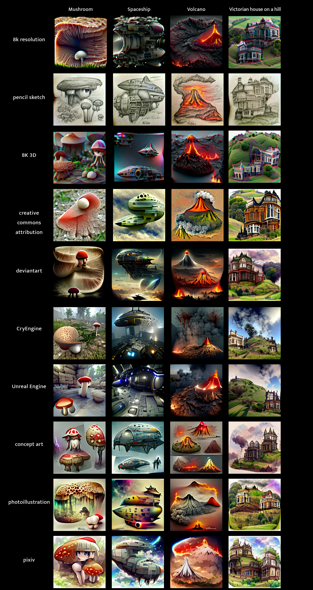

# imagen
image generator

using replicate API
https://replicate.com/docs/api/getting-started-public

# Models:
various text2image modeals

-  Pixray
https://replicate.com/pixray/text2image

# Setup

get an API key from replicate and export it
https://replicate.com/docs/api/getting-started-public

for example

`cp .env.example .env`

edit the `.env` file to add your key then

`source .env`

```bash
# first time: install virtual env:
python3 -m venv venv

# activate venv
source venv/bin/activate

# install pip modules
pip install -r requirements.txt

```

# Running

`make run`

this will execute the `run` command inside the [Makefile](./Makefile)

# Docs

settings:
https://dazhizhong.gitbook.io/pixray-docs/docs/primary-settings



artstyles:

https://bardotbrush.com/30-art-styles-to-try-in-procreate/

